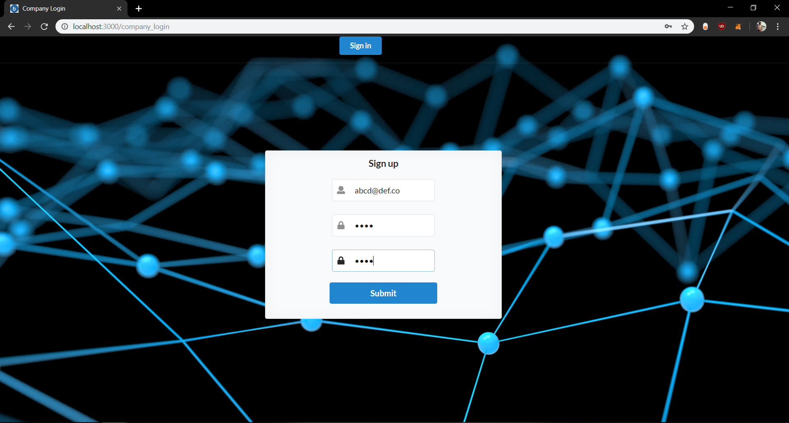
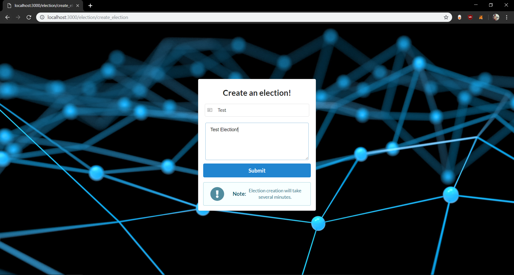

# Hệ thống bầu cử dựa trên nền tảng Blockchain

Một hệ thống bỏ phiếu điện tử dựa trên blockchain, được tạo ra như là dự án năm cuối của trường Đại học Bách khoa Shri Bhagubhai Mafatlal. Đồng đội bao gồm tôi, Sayyam Gada và Charmee Mehta.


## Chạy ứng dụng

```bash
# Cài đặt các gói
npm install

# Chạy server
npm start
```

Tạo file <b>.env</b> trong thư mục chính với nội dung sau:
```bash
EMAIL=YOUR_EMAIL_ID
PASSWORD=YOUR_PASSWORD_FOR_EMAIL_ID
```
Cài đặt tiện ích MetaMask trên Chrome (https://metamask.io/download.html) à đảm bảo có một số Ether để kiểm tra ứng dụng cục bộ. Ether có thể được tìm nạp từ Rinkeby Faucet (https://faucet.rinkeby.io)

#### Chú ý:
- Đảm bảo cài đặt Node.js v11.14.0 để đảm bảo ứng dụng chạy tốt. Việc kiểm tra các phiên bản nút khác vẫn chưa được thực hiện.
- MongoDB phải hoạt động ở chế độ nền trên localhost: 27017

###### Hãy gắn dấu sao repo nếu dự án này giúp bạn theo bất kỳ cách nào!

## Các công nghệ sử dụng:

- Solidity/Web3 (để viết / kết nối hợp đồng Blockchain)
- Next.js & Semantic UI React (front-end)
- MongoDB/ExpressJS/Node.js (back-end)
- IPFS (lưu trữ tệp cho hình ảnh)

## Ảnh chụp màn hình của ứng dụng:

Trang chủ của ứng dụng:


Cơ quan đăng ký / đăng nhập:



Cơ quan tạo một cuộc bầu cử nếu không được tạo:



Trang chủ về tạo cuộc bầu cử thành công:


Danh sách các ứng cử viên cho cuộc bầu cử (tại đây, bạn có thể thêm các ứng cử viên):


Ứng viên đã được thông báo trên thư:


Danh sách cử tri cho cuộc bầu cử (tại đây, bạn có thể thêm cử tri):


Cử tri đã được gửi tên người dùng và mật khẩu an toàn của họ qua thư:


Trang đăng nhập dành cho cử tri:


Kịch bản bỏ phiếu thành công:


Kịch bản bỏ phiếu không thành công:


Thông báo cho từng ứng cử viên và cử tri về ứng cử viên chiến thắng cuộc bầu cử:


